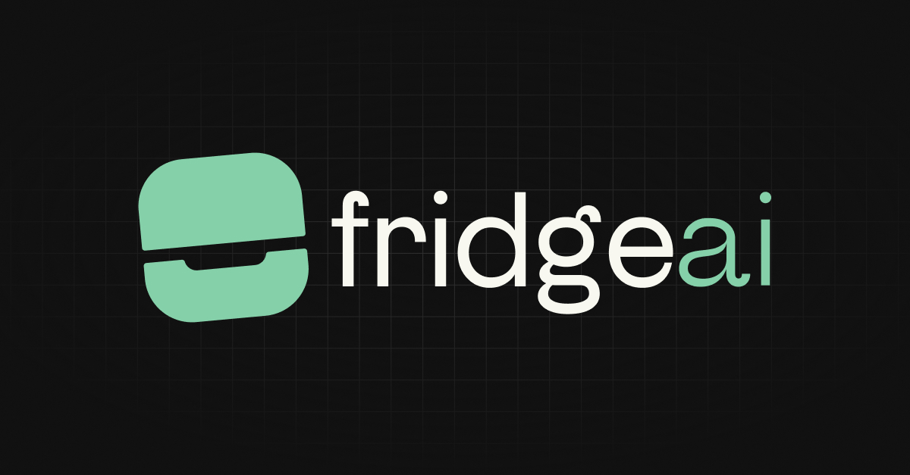

# Fridge AI 🍽

PWA para el Hackathon de SDK AI de Vercel, impulsada por Midudev.

## Descripción

Tu frigorífico digital vitaminado con AI. Esta aplicación te permite equilibrar y hacer mas sano tu menu semanal. Almacena todo en tu frigorífico y deja que la IA haga el resto.

## Funcionalidades

- Almacena tus preferencias en local storage
- Actuliza tus datos en cualquier momento:
  - Ingredientes que te gustan
  - Ingredientes que no te gustan
  - Tiempo de preparación medio para tus platos
  - Visualiza solo las comidas que necesitas
- Genera un menú semanal sano y equilibrado con AI
  - Obtén recetas alternativas para tus platos
  - Genera la preparación para la receta
- Genera una lista de compras para tu menú semanal:
  - Listado de ingredientes por plato
  - Listado de ingredientes por día
  - Listado de ingredientes por semana

## Tecnologías

- SvelteKit
- Vercel AI SDK
- Cohere
- Tailwind
- TypeScript

## Diseño de prototipo

[View in Figma](https://www.figma.com/design/SYq4uQTkuRnJQl2cuccejy/Untitled?node-id=0-1&t=LO49p6sCoPetMl4e-1)

## TODO

- [x] Generar páginas y navegación
- [x] Preparar esquemas y local storage
- [x] Inicio guiado para almacenar preferencias
- [ ] UI base
  - [x] Home
  - [x] Meals
  - [x] Shopping list
  - [ ] Settings
- [x] Prompt engineering
- [x] Prompt a json
- [x] Alergia intolerancia o preferencias
- [x] Añadir tiempo de preparación en los platos
- [x] Mover nav al header en desktop
- [x] Regenerar menu diario completo
- [x] Botón borrar datos y cookies
- [x] Añadir cantidades en los ingredientes
- [x] Revisar ingredientes en route shopping list
- [x] Usar desctruccturacion para excluir posibles resuktados extra de la AI
- [ ] Añadir tiempo de preparación medio en los ajustes del usuario
- [ ] Añadir comidas a visualizar en los ajustes del usuario
- [ ] Completar dark mode
- [ ] Añadir a los prompts informacion nutricional (porcentages semanales y diarios)
- [ ] Auto-completar ingredientes en tour
- [ ] Historial platos generados
- [ ] Aviso instalacion PWA
- [ ] Crear tests
- [ ] Webapp landing page
