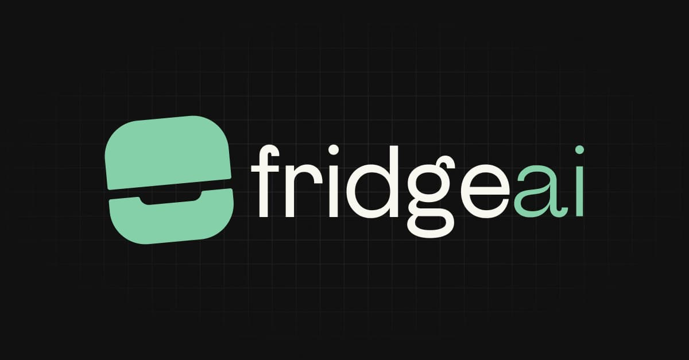

# Fridge AI 🍽

PWA para el Hackathon de SDK AI de Vercel, impulsada por Midudev.

## Descripción

Tu frigorífico digital vitaminado con AI. Esta aplicación te permite equilibrar y hacer mas sano tu menu semanal. Almacena todo en tu frigorífico y deja que la IA haga el resto.

## Funcionalidades

- Almacena tus preferencias en local storage
- Actuliza tus datos en cualquier momento:
  - Ingredientes que te gustan
  - Ingredientes que no te gustan
  - Tiempo de preparación medio para tus platos
  - Visualiza solo las comidas que necesitas
- Genera un menú semanal sano y equilibrado con AI
  - Obtén recetas alternativas para tus platos
  - Genera la preparación para la receta
- Genera una lista de compras para tu menú semanal:
  - Listado de ingredientes por plato
  - Listado de ingredientes por día
  - Listado de ingredientes por semana

## Tecnologías

- SvelteKit
- Vercel AI SDK
- Cohere
- Tailwind
- TypeScript

## Diseño de prototipo

[View in Figma](https://www.figma.com/design/SYq4uQTkuRnJQl2cuccejy/Untitled?node-id=0-1&t=LO49p6sCoPetMl4e-1)

## TODO

- [x] Generar páginas y navegación
- [x] Preparar esquemas y local storage
- [x] Start tour para almacenar preferencias
- [ ] UI base
  - [x] Home
  - [x] Meals
  - [x] Shopping list
  - [x] Settings
- [x] Prompt engineering
- [x] Prompt a json
- [x] Alergia intolerancia o preferencias
- [x] Añadir tiempo de preparación en los platos
- [x] Mover nav al header en desktop
- [x] Regenerar menu diario completo
- [x] Botón borrar datos y cookies
- [x] Añadir cantidades en los ingredientes
- [x] Revisar ingredientes en route shopping list
- [x] Usar desctruccturacion para excluir posibles resuktados extra de la AI
- [x] Limpirar stores al borrar datos y cookies
- [x] Completar dark mode
- [x] Texto descriptivo en route menus y shopping list debajo del titulo
- [x] Añadir tiempo de preparación medio en los ajustes del usuario
- [x] Añadir comidas a visualizar en los ajustes del usuario
- [x] Tooltips de uso en route home para la primera visita
- [x] Añadir a los prompts informacion nutricional (porcentages semanales y diarios)
- [x] Mejorar dishcard placeholder
- [x] Añadir en ajustes el coste medio de la receta
- [x] Separar en tour alergias/intoloreancias de preferencias
- [x] Quitar platos que te gustan, dejar solo los que no te gustan.
- [x] Añadir opcion de usar Cohere API del usuario.
- [x] Mejorar ui funcionalidad de dislike.
- [ ] Revisar textos, organizar y gramatica.
- [ ] Hacer que los platos no se generen en paralelo para mantener el contexto.
- [ ] Auto-completar ingredientes en tour
- [ ] Boton de agrupar por en la route shopping list
- [ ] Crear tests
- [ ] Crear CHANGELOG.md
- [ ] Webapp landing page
- [ ] Añadir mas idiomas
